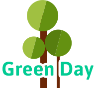
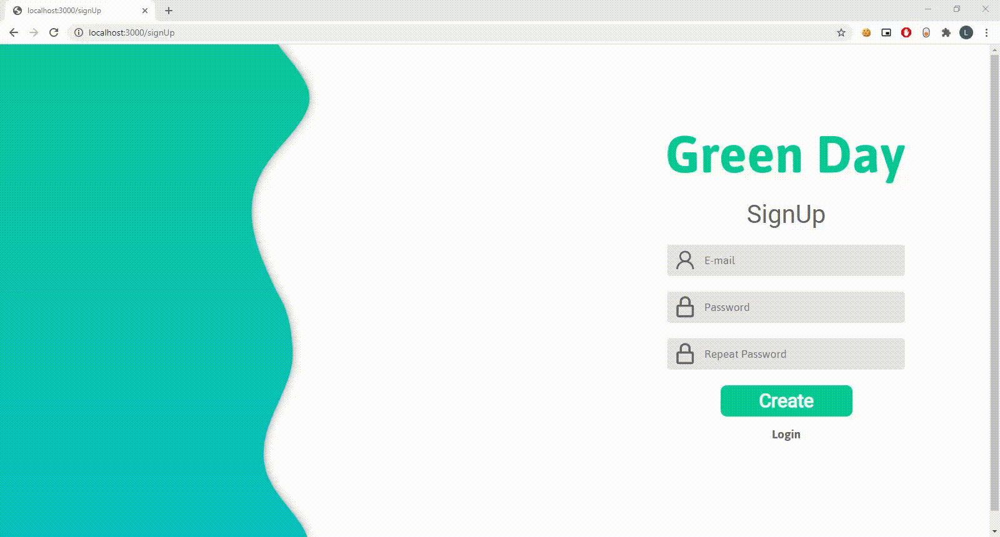
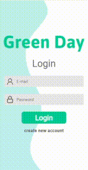

<p align="center">
  
</p>

# Sobre o projeto
  Green day é um projeto que foi criado com o intuito de demonstrar uma tela de login e de cadastro totalmente funcional.

# Layout web
<p align="center">
  
</p>

# Layout mobile
<p>
  
</p>

# 🛠 Tecnologias
As seguintes ferramentas foram usadas na construção do projeto:

### front-end

- [NextJs](https://nextjs.org)
- [ReactJs](https://pt-br.reactjs.org)
- [Typescrypt](https://www.typescriptlang.org)
- [axios](https://www.npmjs.com/package/axios)
- [email-validator](https://www.npmjs.com/package/email-validator)
- [framer-motion](https://www.npmjs.com/package/framer-motion)
- [js-cookie](https://www.npmjs.com/package/js-cookie)
- [react-lottie](https://www.npmjs.com/package/react-lottie)
- [rc-slider](https://www.npmjs.com/package/rc-slider)
- [react-toastify](https://www.npmjs.com/package/react-toastify)
- [react-responsive-modal](https://www.npmjs.com/package/react-responsive-modal)
- [input-files](https://www.npmjs.com/package/input-files)

### back-end
- [bcrypt](https://www.npmjs.com/package/bcrypt)
- [jsonwebtoken](https://www.npmjs.com/package/jsonwebtoken)
- [mongodb](https://www.npmjs.com/package/mongodb)

# Animação
Uma das principais implementações foram as animações de mudança de páginas e de outros elementos:




# Back-End
O back-end foi construído em [Serverless](https://www.serverless.com) seguindo os seguintes caminhos:
* /api
  * /signUp - cadastra usuários
  * /signIn - verifica se o usuario pode logar ou não
  * /verify - verifica e o e-mail já está em uso

# 🚀 Como executar o projeto

💡 Como o back-end está em Serverless não é necessário executar nenhuma configuração separada para ele.

## Pré-requisitos
Antes de começar, você vai precisar ter instalado em sua máquina as seguintes ferramentas:

 * [Git](https://git-scm.com)
 * [Node.js](https://nodejs.org)
 * [VSCode](https://code.visualstudio.com) ou outro editor de codigos

## 🧭 Rodando a aplicação

⚠️ Quando clonar a aplicação não se esqueça de:
 - Criar url de conexão para banco de dados em .env
 - Criar um segredo para o jwt em secrets/jwt.json

```bash
# Clone este repositório
$ git clone https://github.com/Leandro-Goncalves/greenday

# Acesse a pasta do projeto no seu terminal/cmd
$ cd greenday

# Instale as dependências
$ npm install
# ou
$ yarn

# Execute a aplicação em modo de desenvolvimento
$ npm run dev
# ou
$ yarn dev

# A aplicação será aberta na porta:3000 - acesse http://localhost:3000
```
---

# Author
<a href="https://github.com/Leandro-Goncalves/">
  
 <br />
 <sub><b>Leandro Gonçalves</b></sub></a>

---

## 📝 Licença

Este projeto esta sobe a licença [MIT](./LICENSE).

Feito com ❤️ por Leandro Gonçalves [Entre em contato!](mailto:leandrogoncalvesprofissional@hotmail.com)

---